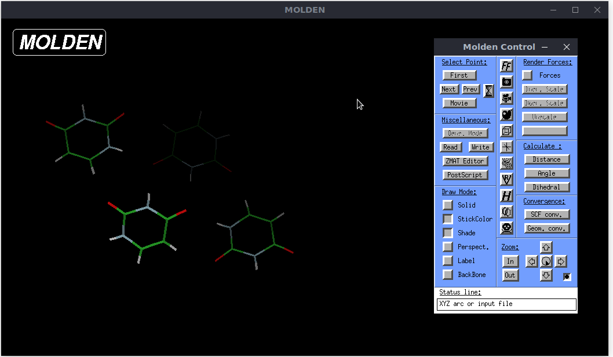

# No-Skull Patch for Molden 💀🛇

Simple and dirty patch for [Molden](https://www.theochem.ru.nl/molden/), the ancient chemical/molecular viewer. Allows to close Molden without the need to click the annoying *Skull Icon*. Works for both the *control panel* and *main window*.



Tested on Molden 7.2 and gcc/gfortran 8.5/9.4/11.2 on a Linux machine.  
No warranty at all, although it is so simple that it should not break anything.


## Usage
1. Download the [source code](https://ftp.science.ru.nl/Molden/) of Molden and untar it
2. Apply the patch: `patch src/xwin.c noskull.diff`
3. Compile Molden
4. Run Molden
5. Close Molden without the skull icon!!!

#### Note
If your gfortran compiler is 10 or higher, you may need to add `-fallow-argument-mismatch` to the `FFLAGS` in the `makefile` before the compilation. This is an issue of *molden* itself and independent of the patch.


## Full and quick compilation example
```
wget https://ftp.science.ru.nl/Molden/molden7.2.tar.gz
tar -xzf molden7.2.tar.gz
cd molden7.2
curl https://raw.githubusercontent.com/boneta/molden-noskull-patch/master/noskull.diff | patch src/xwin.c
make
./bin/molden
```
